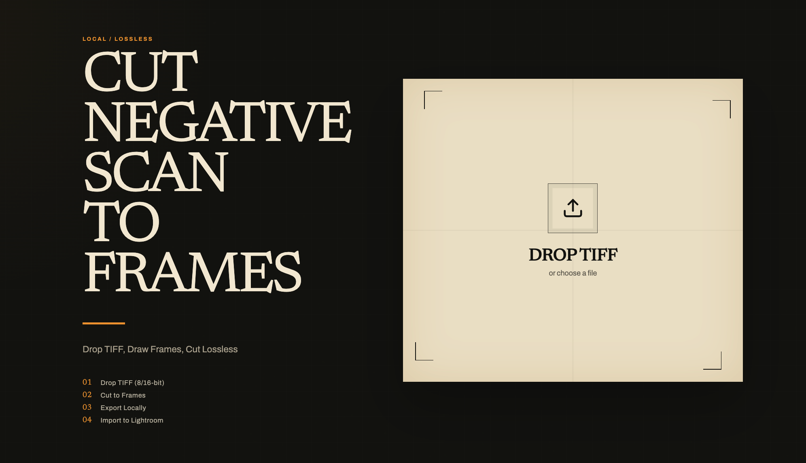
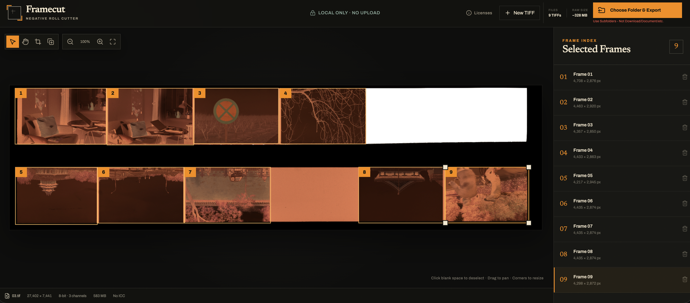

<p align="center">
  
</p>

<h1 align="center">Framecut</h1>

<p align="center">
  Split negative roll scans into individual, pixel-exact TIFF frames — entirely in Chrome.
</p>

<p align="center">
  <a href="https://github.com/stabruriss/framecut/releases/latest/download/Framecut.html"><strong>Download Framecut.html</strong></a>
  ·
  <a href="https://github.com/stabruriss/framecut/releases">All releases</a>
  ·
  <a href="./LICENSE">MIT License</a>
</p>

<p align="center">
  <strong>English</strong> · <a href="./README.zh-CN.md">简体中文</a>
</p>

Many photo labs deliver negative scans as a single TIFF containing multiple frames.

Framecut lets you mark the bounds of each frame directly on the TIFF, split the scan into pixel-exact individual TIFFs, and batch-export them to a folder ready for import into Lightroom for film-mask removal and editing.

Everything runs locally in Chrome. There is no app to install, no internet connection is required, and your photos are never uploaded.

## Interface





## Quick start

1. [Download `Framecut.html`](https://github.com/stabruriss/framecut/releases/latest/download/Framecut.html).
2. Open it in desktop Chrome. If another browser is your default, drag the file into Chrome or use **Open With → Google Chrome**.
3. Drop a `.tif` or `.tiff` onto the page.
4. Draw one frame around each photograph. Frames may overlap.
5. Select **Choose Folder & Export** and choose a writable subfolder. Framecut creates a timestamped batch folder and writes every cropped TIFF into it.

An address beginning with `file:///` is expected. The interface, fonts, Worker, libtiff, and WebAssembly engine are all embedded in the HTML file. No local server or network request is required.

> Chrome protects top-level folders such as Downloads and Documents. Create or select a normal subfolder inside them, such as `Downloads/Framecut`, and export there.

## Features

- One portable HTML file; no installer, backend, or account
- Local, offline processing in desktop Chrome
- Pixel-exact 8-bit and 16-bit TIFF cropping
- Non-destructive clockwise and counterclockwise rotation before cropping
- Multiple overlapping frames
- Move, resize, duplicate, and delete crop frames
- Orientation-aware preview and export for TIFF `Orientation=1–8`
- Sequential folder export for predictable memory use
- ZIP fallback when direct folder access is unavailable
- ICC profile and common photographic metadata preservation

## Controls

| Action | Control |
| --- | --- |
| Draw a frame | Draw tool or `D`, then drag |
| Select a frame | Click the frame or use `V` |
| Move the image | Hand tool or `H`; hold Space while dragging from any tool |
| Rotate the scan | Rotate counterclockwise / clockwise buttons |
| Duplicate a frame | Duplicate button or `Command/Ctrl + C`, then `Command/Ctrl + V` |
| Delete a frame | `Delete` or `Backspace` |
| Zoom | Mouse wheel or the zoom controls |
| Clear a selection | Click outside the selected frame |

## Supported TIFFs

| Property | Support |
| --- | --- |
| Pages | First page of a TIFF |
| Samples | Unsigned 8-bit or 16-bit |
| Color | Grayscale (`MinIsBlack` / `MinIsWhite`) or three-channel RGB |
| Layout | Stripped, Planar Contiguous |
| Orientation | `1–8`, normalized automatically |
| Input compression | None, LZW, PackBits, Deflate / Adobe Deflate |
| Output | Classic TIFF, Adobe Deflate, horizontal predictor |
| Maximum raw pixels per frame | 384 MiB |
| Maximum decoded source strip | 512 MiB |

Not currently supported:

- Tiled TIFF or Planar Separate TIFF
- Alpha, CMYK, Lab, floating-point, or signed samples
- JPEG-in-TIFF and compression formats not listed above
- BigTIFF output
- Layered Photoshop TIFFs, complex SubIFDs, or arbitrary proprietary scanner tags

## What “pixel-exact” means

The production export path does not use the browser Canvas. Canvas is used only for an 8-bit positioning preview, capped at 2400 pixels. The libtiff engine decodes the relevant source strips, copies each 8-bit or 16-bit sample from the selected region without scaling, interpolation, or color conversion, and re-encodes the result with Adobe Deflate and a horizontal predictor.

The cropped image samples therefore match the corresponding source samples exactly. Quarter-turn rotation only rearranges whole samples; it does not interpolate or rewrite the source TIFF. The output is not byte-for-byte identical to the source: compression streams, strip layout, and some TIFF tags change. ICC profiles, resolution, white point, chromaticities, and common descriptive fields are preserved when present. XMP/XMLPacket data, Photoshop resource blocks, layers, and unsupported private tags are intentionally not copied.

## Export and memory

Desktop Chrome uses the File System Access API to write each result as soon as it is encoded. Every export creates a folder such as `framecut-20260727-090503`, containing files such as `framecut-20260727-090503-01.tif`.

If folder access is unavailable, Framecut builds a ZIP in memory. ZIP fallback is limited to 512 MiB of estimated raw pixels and 512 MiB of accumulated encoded TIFF data. Large scans or many frames should use direct folder export.

The single-file engine runs libtiff in a dedicated Worker. TIFF work stays off the interface thread, but the engine is single-threaded and will not use every CPU core. Source data is read incrementally by strip rather than copied into one full-file `ArrayBuffer`.

## Browser support

Desktop Google Chrome is the release target. Other Chromium browsers may work, but are not part of the release baseline. Safari and Firefox are not currently supported.

## Development

Requirements:

- Node.js `20.19+` or `22.12+`
- npm

```bash
npm ci
npm test
npm run build:single
```

The distributable is generated at:

```text
dist-single/Framecut.html
```

The generated single-threaded libtiff engine is committed to the repository, so normal development does not require Emscripten. Rebuilding the engine itself requires Emscripten `4.0.23`:

```bash
./scripts/build-libtiff-engine.sh
npm run build:single
```

See [CONTRIBUTING.md](./CONTRIBUTING.md) for contribution guidelines and [THIRD_PARTY_NOTICES.md](./THIRD_PARTY_NOTICES.md) for dependency licenses.

## License

Framecut is released under the [MIT License](./LICENSE).
